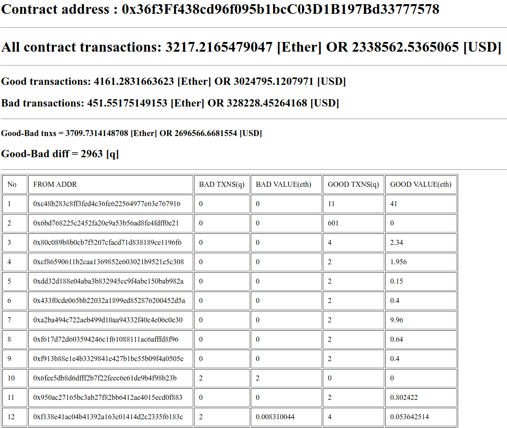

#PHP Etherium Contract Info#

  Simple program to get and count all incoming transactions from ETHERIUM contract.
Wrote to analyze an ICO contract faster.
Uses [ETHERSCAN.io](https://etherscan.io) web interface via file_get_data() (no eth API or CURL!).
Prints statistycs to the screen with counted all contract transactions.

**How to use?**
1. Change $contractAddr variable to ETH addr for analyze
2. Change $ethUsd variable for better ETH/USD currency
3. Change $pages variable (get pages value from https://etherscan.io/txs?a=<CONTRACT-ADDR>)
4. RUN *etheriumcontractinfo.php* and wait from 5min. to ~15min.

**Results**
The results will be on the screen and you will see:
1. All contract transactions (in ETH and USD)
2. All good and bad transactions (tnxs quantity, value in ETH and USD)
3. Difference bitween Good and Bad txns
4. Table with all incoming addresses, its total (bad and good) transactions and values (quantity and ETH value)

**Screenshot**

